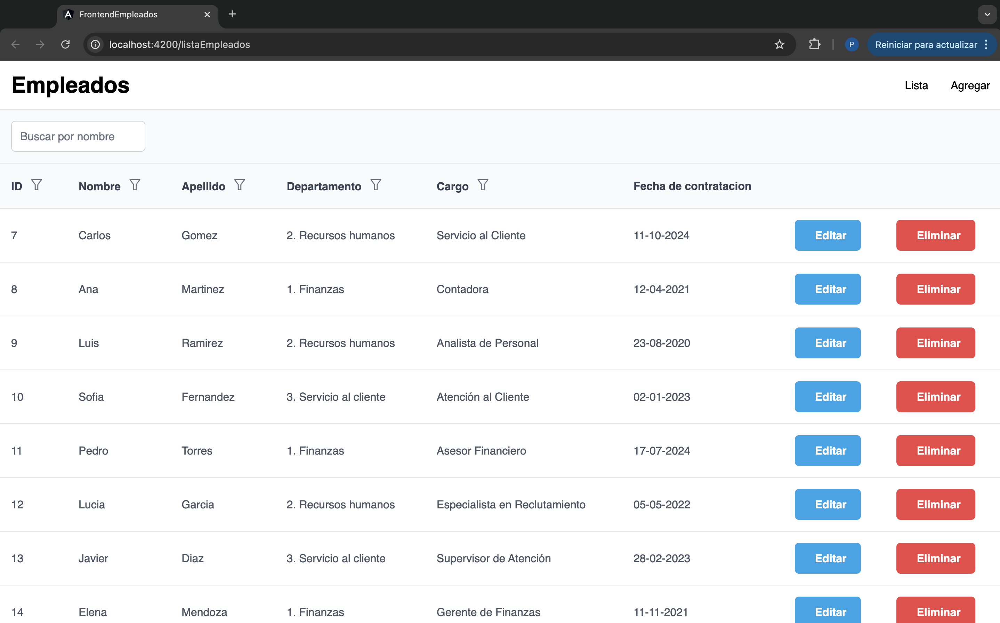
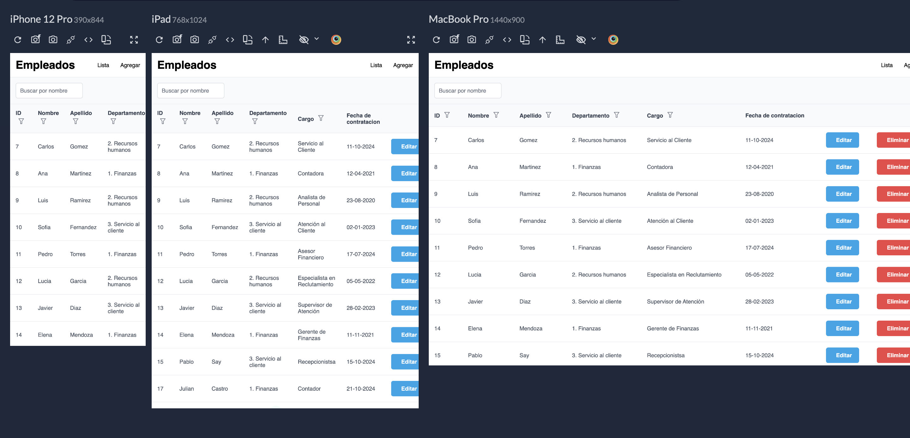
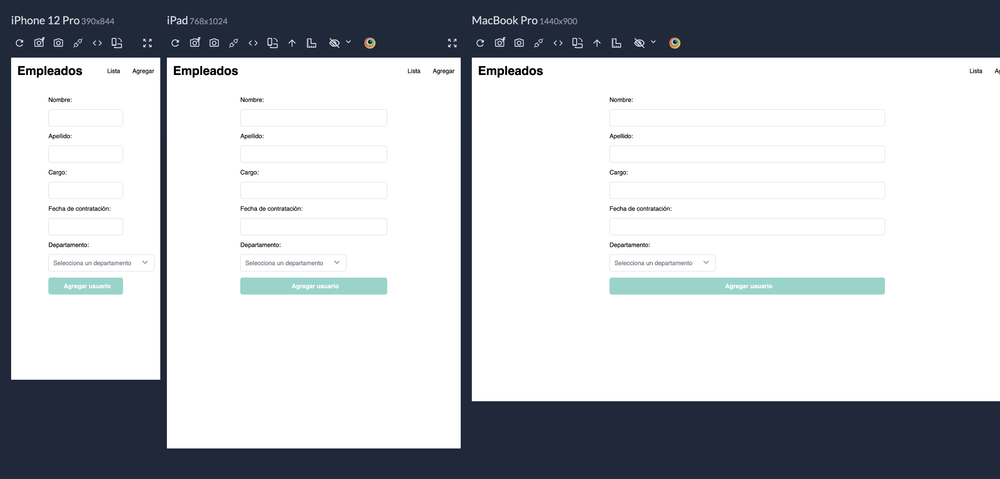
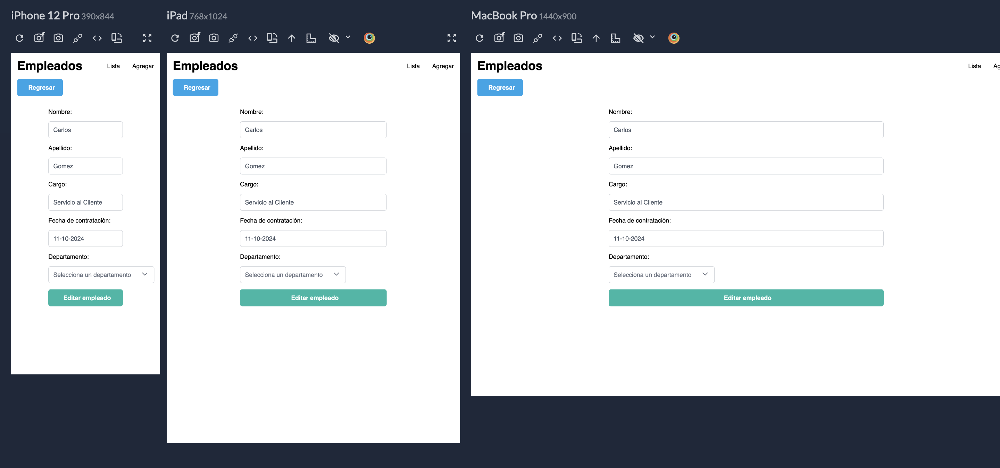
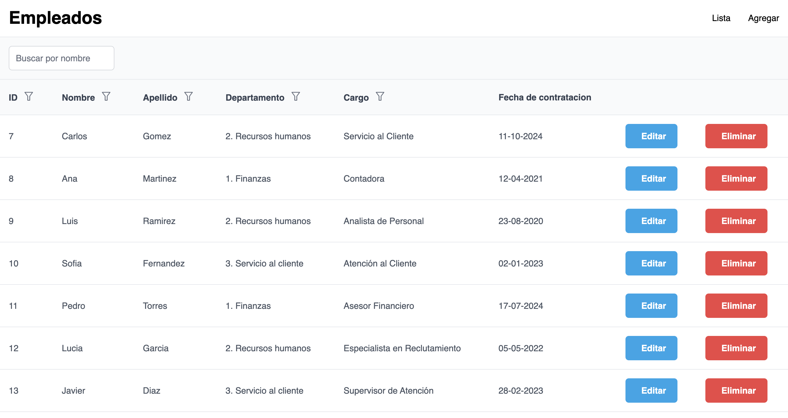

# FrontendEmpleados

Código fuente para aplicación de gestión de empleados.

![Angular]
![AngularCLI]
![Primeng]

<div align="center"> <div align = "center">  </div>  </div>

## Backend

Para que la aplicación funcione, debe instalar el backend en este [repositorio](https://github.com/pablosayc21/backend-empleados). 

## Guía de instalación

```bash
# 1. Instalar Angular CLI version 16.2.4 dlobalmente (Si no lo tenía previamente instalado)
npm install -g @angular/cli@16.2.4


# 2. Clonar el repositorio
git clone https://github.com/pablosayc21/frontend-empleados.git

# 4. Ingresar al directorio
cd frontend-empleados

# 5. Instalar el repositorio
npm install

# 6. Iniciar el servidor
npm start
```

## Ejecución

Ejecuta `ng serve` para un servidor de desarrollo. Entra `http://localhost:4200/`. La aplicación se recargará automáticamente si hay algún cambio en los archivos.

## Incluye

> Dependencias
- [x] Angular : 16.2.0
- [x] Angular CLI : 16.2.4
- [x] PrimeNG : 17.18.11
- [x] RxJS : ~7.8.0
- [x] TypeScript : ~5.1.3
- [x] Zone.js : ~0.13.0

> Funcionalidades
- [x] Routing
- [x] Lazy Loading
- [x] Server Side Rendering (SSR)
- [x] Progressive Web App (PWA)
- [x] Responsive Layout
- [x] Search Engine Optimization (SEO)
- [x] Components
- [x] Services
- [x] Reactive Forms
- [x] Template Driven Forms
- [x] Search / Grid / Pagination


## Reponsive

<div align="center"> <div align = "center">  </div>  </div>

<div align="center"> <div align = "center">  </div>  </div>

<div align="center"> <div align = "center">  </div>  </div>

<div align="center"> <div align = "center">  </div>  </div>

## Autores
* [Pablo Say](https://github.com/pablosayc21)

## Contacto

[Instagram](https://www.instagram.com/pablosc_21/) 

[LinkedIn](https://www.linkedin.com/in/PabloSay21/)


[Angular]:https://img.shields.io/badge/Angular%2016.2.4-gray?logo=angular
[AngularCLI]:https://img.shields.io/badge/Angular%20CLI%2016.2.4-gray?logo=angular
[Primeng]:https://img.shields.io/badge/primeng%2017.18.11-gray?logo=primeng
